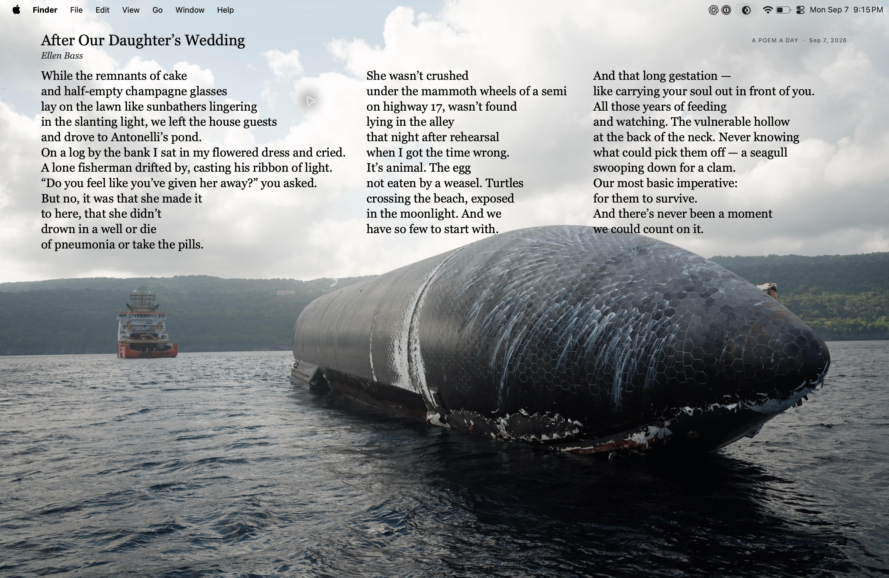

<p align="center">
  
</p>

# Poem Desktop

A poem for your workday. A small native Mac app that places the latest poem from [A Poem A Day](https://apoemaday.tumblr.com/) quietly over your wallpaper.

Black serif type. Original line breaks. The whole poem, on one desktop.

[Download for Mac](https://github.com/grinich/poem-desktop/releases/latest/download/PoemDesktop.dmg) · macOS 13 or later · Apple silicon and Intel



*Shown: “After Our Daughter’s Wedding” by Ellen Bass, from A Poem A Day.*

## Install

1. Download and open **PoemDesktop.dmg** from the [latest release](https://github.com/grinich/poem-desktop/releases/latest).
2. Move **Poem Desktop.app** to **Applications** and open it.
3. Open the app again to see its controls, then enable **Start automatically when I log in**.

The poem appears behind your windows on your main display, across desktop Spaces. The overlay lets clicks pass through to your desktop. It has no Dock or menu-bar icon, and starts quietly when you log in.

**To find the controls, open Poem Desktop again** from Applications or Spotlight. Closing the controls leaves the poem running. If macOS asks you to approve startup, the app directs you to **System Settings → General → Login Items**.

Release builds check for app updates daily through [GitHub Releases](https://github.com/grinich/poem-desktop/releases), verify the developer signature, and install and relaunch automatically. You can also choose **Check for updates** in the controls.

## Make it comfortable

Use the **Text size** dropdown to choose **Smallest**, **Smaller**, **Comfortable**, **Larger**, or **Largest**. Changes appear immediately and are remembered when you restart. Turn on **Soft paper backing** if your wallpaper needs a little contrast. The controls also let you refresh, hide the poem, open its original page, or quit.

The **Typeface** dropdown offers Georgia, Palatino, Baskerville, Times New Roman, and Iowan Old Style when installed on your Mac. A live preview beneath the dropdowns shows the selected typeface at your chosen text size. Your typeface applies to the title, author, poem, and larger reader, and is remembered between launches. Georgia is the default.

Original verse lines and blank stanza breaks stay intact. When a poem needs columns, read down each column, then continue to the next one on the right.

Short poems sit in the upper third of the desktop. Longer poems use more vertical space before the type gets smaller. The entire poem stays on a single desktop, without wrapping verse lines or splitting into pages.

For an unusually large poem, the app reduces the type to fit; its final fallback scales the complete composition. If the desktop text becomes small, **Read larger** opens a separate reader with 21-point type and scrolling while preserving the same lines. The complete poem remains on the desktop.

## A new poem, when it arrives

Poem Desktop checks when it starts, when your Mac wakes, when the calendar day changes, and every 30 minutes. It keeps the latest published poem until the site posts another, so the date shown is the poem's publication date. The source does not publish on every calendar day.

If you're offline, your last downloaded poem stays visible. Failed requests retry automatically.

## Privacy and poem credits

No account or API key is required. There are no analytics. The app fetches poems from the public Tumblr RSS feed and checks GitHub's release infrastructure for app updates. It does not change your wallpaper image or request Accessibility or Screen Recording access.

The latest poem is cached locally at:

```text
~/Library/Application Support/Poem Desktop/latest-poem.json
```

Poems are fetched from [A Poem A Day](https://apoemaday.tumblr.com/) and credited to their authors. **Read on the site** opens the original post. Poem text is not bundled with the app or committed as test fixtures. Poem Desktop is an independent app.

## Build from source

Requires macOS 13 or later and Apple's Swift tools, available through Xcode or Command Line Tools.

```sh
git clone https://github.com/grinich/poem-desktop.git
cd poem-desktop
./scripts/build.sh
```

The local build produces a universal `dist/Poem Desktop.app` for Apple silicon and Intel. To install it in `~/Applications`, launch it, and enable login startup:

```sh
./scripts/install.sh
```

Local builds use ad hoc code signing. The app icon source is `Resources/AppIcon.png`; regenerate its native icon with `./scripts/make-icon.sh Resources/AppIcon.png`.

## Tests and layout checks

```sh
CLANG_MODULE_CACHE_PATH="$PWD/.build/module-cache" swift test --disable-sandbox
./scripts/build.sh
"dist/Poem Desktop.app/Contents/MacOS/PoemDesktop" --smoke-test --output-dir test-output
"dist/Poem Desktop.app/Contents/MacOS/PoemDesktop" --fetch-test
```

Unit tests cover feed parsing and the offline cache. Native smoke tests check desktop placement, transparency, click-through behavior, focus, Spaces, and complete line-preserving layouts. They also exercise extreme line lengths, a 1,000-line poem, and the larger reader. Native window tests require a logged-in macOS desktop session; the fetch test requires a network connection.

To test current source formatting, save the public feed to a local XML file, set `POEM_FEED_FIXTURE` for the unit tests, and pass `--feed-file /path/to/feed.xml` to the smoke test.

### A year of poems

The September 7, 2025–September 7, 2026 public archive was checked through the production parser and renderer: **230 poems, 920 layouts, no clipping, missing lines, wrapping, or pagination**. Checks included Comfortable, Larger, and Largest on a 1470 × 956 desktop and the default preference on a 1280 × 800 desktop. Two poems on the larger display and three on the smaller display needed type below 14 points, for which **Read larger** is available.

An additional audit checked all five typefaces at all five text sizes on the main display, plus each typeface at the default size on the smaller display: **6,900 layouts across the same 230 poems, with no overflow or changed line breaks**. Add `--all-typefaces` to the audit command below to reproduce this expanded check.

Reproduce the audit with:

```sh
python3 scripts/fetch-year-archive.py --start 2025-09-07 --end 2026-09-07
"dist/Poem Desktop.app/Contents/MacOS/PoemDesktop" --audit-archive \
  --archive-dir test-output/year-audit --output-dir test-output/year-audit/layout
```

The collector follows archive pages past the cutoff, verifies overlapping live RSS entries, and records absent dates and unsupported posts. Add `--refresh` to download fresh source responses. The report is written to `test-output/year-audit/layout/annual-layout-audit.md` and `.json`. Coverage includes currently public posts; deleted or private posts cannot be checked.

Downloaded poems and generated previews stay under ignored `test-output/`. Keep these local artifacts out of commits and releases.

## Uninstall

Open the controls, disable **Start automatically when I log in**, and choose **Quit**. Move the app to Trash. You can also remove `~/Library/Application Support/Poem Desktop` to delete its offline cache.

## Releases and license

See [Releasing](docs/RELEASING.md) for the repeatable Developer ID signing, Apple notarization, and GitHub release process. GitHub Actions checks tests and universal builds on every push and pull request; its development artifacts use ad hoc signing.

App source and icon are available under the [MIT License](LICENSE). The poems belong to their respective authors and are not covered by this license.
